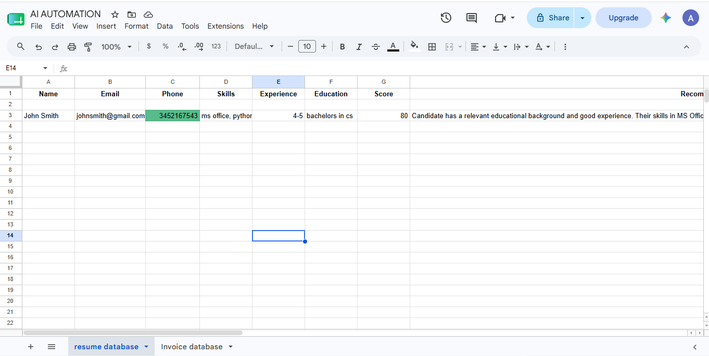
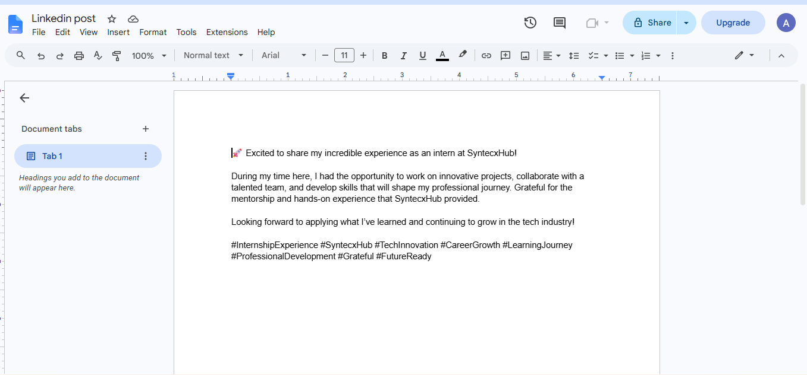
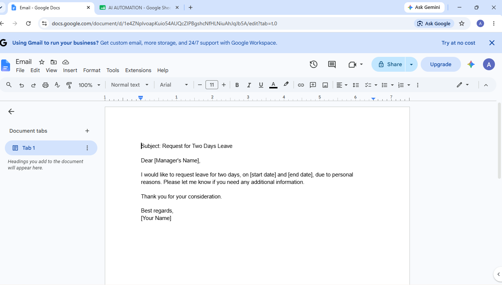
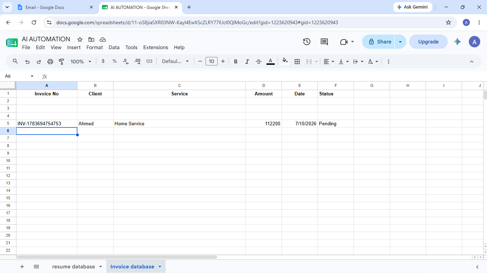
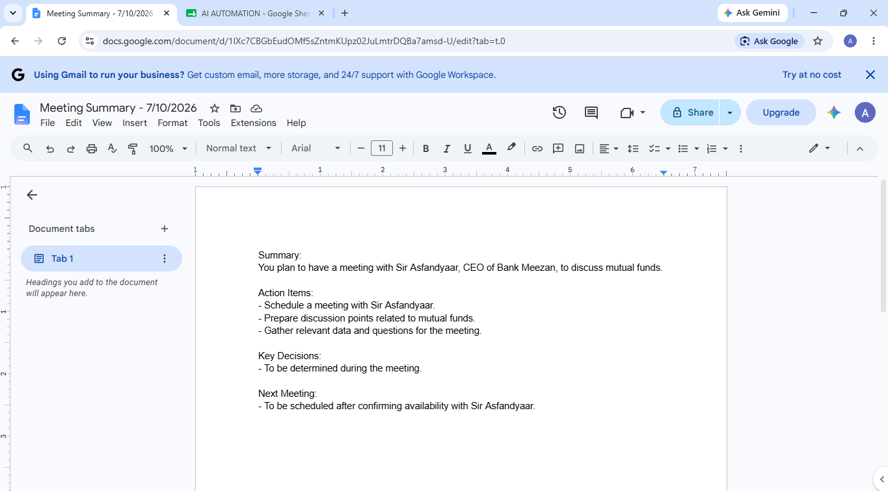

# 🤖 AI Business Assistant (n8n + OpenRouter)

An AI-powered Business Assistant built using **n8n**, **OpenRouter**, and **Google Workspace APIs**. The assistant intelligently detects user intent and automates multiple business tasks through a single conversational interface.

## 🎥 Demo Video

https://youtu.be/BSus61RA0T4

## 🚀 Features

- 📄 Resume ATS Analysis
- 📊 Stores Resume Data in Google Sheets
- 📧 AI Email Writer
- 📑 Saves Emails to Google Docs
- 📝 Meeting Notes Generator
- 📄 Stores Meeting Notes in Google Docs
- 💼 LinkedIn Post Generator
- 📄 Saves LinkedIn Posts to Google Docs
- 🧾 Invoice Generator
- 📊 Stores Invoice Details in Google Sheets
- 💬 General Business AI Assistant
- 🧠 Intent Routing using AI

---

## 🛠️ Tech Stack

- n8n
- OpenRouter AI
- Google Sheets API
- Google Docs API
- Gmail API
- JavaScript
- Prompt Engineering
- AI Agents

---

## 📌 Workflow

```
User Message
      │
      ▼
Intent Router (AI)
      │
      ▼
Switch Node
      │
      ├── Resume Analyzer
      ├── Email Writer
      ├── Meeting Tool
      ├── LinkedIn Tool
      ├── Invoice Generator
      └── General Assistant
```

---

## 📂 Modules

### 📄 Resume Analyzer
- Extracts candidate information
- Calculates ATS Score
- Identifies missing skills
- Provides hiring recommendation
- Stores candidate data in Google Sheets

---

### 📧 Email Writer
- Generates professional emails
- Saves generated email to Google Docs

---

### 📅 Meeting Tool
- Creates structured meeting notes
- Saves notes to Google Docs

---

### 💼 LinkedIn Tool
- Generates engaging LinkedIn posts
- Creates a new Google Doc
- Inserts the generated content automatically

---

### 🧾 Invoice Generator
- Generates invoice information
- Stores invoice data in Google Sheets

---

### 💬 General Assistant
- Answers general business-related questions
- Provides professional responses

---

## 📸 Screenshots


<details>
  <summary>📸 Click here to view Project Screenshots</summary>
  <br>
  
  ### 1. Intent Routing Flow
  
  
  ### 2. Resume ATS Analyzer
  
  
  ### 3. Google Sheets Automation
  

  ### 4. Meeting Summarizer
  

  ### 5. Invoice Generator
  

  ### 6. Email Writer & General Assistant
  
</details>

---

## 🔮 Future Improvements

- PDF Resume Upload
- Google Calendar Integration
- WhatsApp Integration
- Telegram Bot
- Memory Support
- PDF Invoice Generation

---

## 📖 How to Run

1. Import the workflow JSON into n8n.
2. Connect your OpenRouter API key.
3. Connect Google Sheets, Docs, and Gmail credentials.
4. Publish the workflow.
5. Start chatting with the AI Business Assistant.


---

## ⭐ If you found this project useful, don't forget to star the repository!
